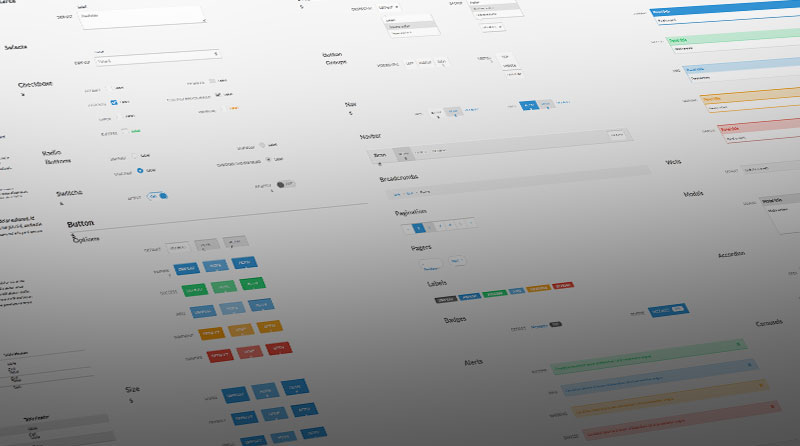

# BootGrid - A lightweight framework with a custom 12 colum grid that takes inspiration from bootstrap. 
It adds a lot of other functionalities.
All of the layout is built using flexbox.

Check the [Features](#features) to know more.



## Table of content
- [Description](#description)
- [Usage](#usage)
- [Features](#features)
- [Installation](#installation)
- [Scripts](#scripts)
- [ToDos](#todos)
- [Contact](#contact)


## Description

This template uses the following:

- ### Modern CSS
- ### BEM Methodology
- ### Custom 4 column grid
- ### SASS
  - `variables`
  - `nesting`
  - `parials and imports`
  - `mixins`
  - `functions`
  - `extends`
- ### 7-1 project structure for SASS Files -

  - `base/`
  - `components/`
  - `layout/`
  - `pages/`
  - `themes/`
  - `abstracts/`
  - `vendors/`

A [build script](#scripts) is created to accomodate older browser compatibility

## Usage
The framework is easy to use. Just add the ```css/style.css``` file to your project directory and You're good to go.
1. Define ```.container``` class to you parent element for
2. Define ```.row``` class to your grid container
3. Define ```.col-*``` for different column sizes. Checkout [feature](#features) for different available options.

To tweak the framework, please checkout [installation](#installation)

# Features

## Base Layout
### Basic CSS Reset
- removes padding,margin etc. 
- set the default width to 62.5% to build a rem based layout
- container width - 144rem (1440px)

### Responsive 12-column grid
- You can mix and match the 12 provided columns to achieve the desired layout
```col-1``` , ```col-2``` ........ ```col-12```
- 5 different sizes are available to accommodate different display sizes
  - x-small -> Usage: ```col-xs-1``` ... ```col-xs-12```
  - small -> Usage: ```col-sm-1``` ... ```col-sm-12```
  - medium -> Usage: ```col-md-1``` ... ```col-md-12```
  - large -> Usage: ```col-lg-1``` ... ```col-lg-12```
  - x-large -> Usage: ```col-xl-1``` ... ```col-xl-12```

### Colors
Default colors - ```default```, ```primary```, ```secondary```, ```success```, ```info```,```warning```, ```danger```, ```muted```, ```white```, ```black```
1. Text colors - Just append the ***default color*** to the text class to get the desired color. Ex: ```text-primary```
- Light, dark, lighter and darker versions are also available. Ex: ```text-default-light```, ```text-default-lighter```, ```text-default-dark```, ```text-default-darker```
2. Background colors - Just append the ***default color*** to the bg class to get the desired color. Ex: ```bg-primary```

### Typography
1. Add base styles to headers. ```h1``` ... ```h6```, ```p```, ```subtitle```, ```lead```, ```small```
2. Font weights: ```font-weight-thin``` , ```font-weight-light```, ```font-weight-regular```, ```font-weight-bold```, ```font-weight-black```

## Components

### Buttons
Need to add ```btn``` class first.
1. Primary button - ```btn--primary```
2. Secondary button - ```btn--secondary```
3. Underlined button - ```btn--underlined```

### Card - ```card```

### hr
```hr--light``` , ```hr--blue```, ```hr--primary```

## Utility Classes

### Display classes - Defines all the classes for display, positioning etc
```d-flex``` , ```flex-column```, ```flex-row```, ```justify-content-start``` etc.
Please look at ```utls/_display.scss``` to know more

### Margins
- There are 12 margin sizes available for each side. Each size equals ```rem``
- Usage
  - For margin left - ```ml-1``` ... ```ml-12```
  - For margin right - ```mr-1``` ... ```mr-12```
  - For margin top - ```mt-1``` ... ```mt-12```
  - For margin bottom - ```mb-1``` ... ```mb-12```
  - For margin top and bottom, there is a helper: ```my-1```...```my-12```
  - For margin left and right, there is a helper: ```mx-1```...```mx-12```

### Padding
- There are 12 padding sizes available for each side. Each size equals ```rem``
- Usage
  - For padding left - ```pl-1``` ... ```pl-12```
  - For padding right - ```pr-1``` ... ```pr-12```
  - For padding top - ```pt-1``` ... ```pt-12```
  - For padding bottom - ```pb-1``` ... ```pb-12```
  - For padding top and bottom, there is a helper: ```py-1```...```py-12```
  - For padding left and right, there is a helper: ```px-1```...```px-12``` 

## Installation

1. Clone the project to your local directory
```
git clone https://github.com/KaushikShivam/bootgrid.git
```

2. The project uses NPM for managing dependencies. Run npm install to install all the required dependencies
```
npm install
```
3. Run the watch script to view live changes to your CSS
```
npm run watch:sass
```
4. Open the index.html file in your browser to view the website in all its glory (Live-server is recommended to view live changes automatically)


## Scripts
The project uses [AutoPrefixer](https://github.com/postcss/autoprefixer), [Node-sass](https://github.com/sass/node-sass), [npm-run-all](https://www.npmjs.com/package/npm-run-all) etc to build the following scripts:

### Watch live changes in development
1. Watch live changes to the sass
```
"watch:sass": "node-sass sass/main.scss css/style.css -w"
```
Run ```npm run watch:sass``` to run the script

### Build script for production

1. Compile sass files
```
"compile:sass": "node-sass sass/main.scss css/style.comp.css"
```

2. Add prefixes automatically to the modern CSS rules (supports last 10 years - Can be configured)
```
"prefix:css": "postcss --use autoprefixer -b 'last 10 versions' css/style.comp.css -o css/style.prefix.css"
```

3. Adds compression
```
"compress:css": "node-sass css/style.prefix.css css/style.css --output-style compressed"
```
4. Final Build process
```
"build:css": "npm-run-all compile:sass prefix:css compress:css"
```

Run ```npm run build:css``` to run the build script

## ToDos
- [ ] Inputs
- [x] Button
- [x] Margin utils
- [x] padding utils
- [ ] navbar
- [ ] pagination

## Contact

You can contact me at:

- [Portfolio](https://www.shivamkaushik.com)
- [Email](mailto:shivamkaushikofficial@gmail.com)
- [Linkedin](https://www.linkedin.com/in/kshivamdev/)
- [Twitter](https://twitter.com/kShivamDev)
- [Medium](https://medium.com/@shivamkaushikofficial)
- [Angellist](https://angel.co/kshivamdev)
